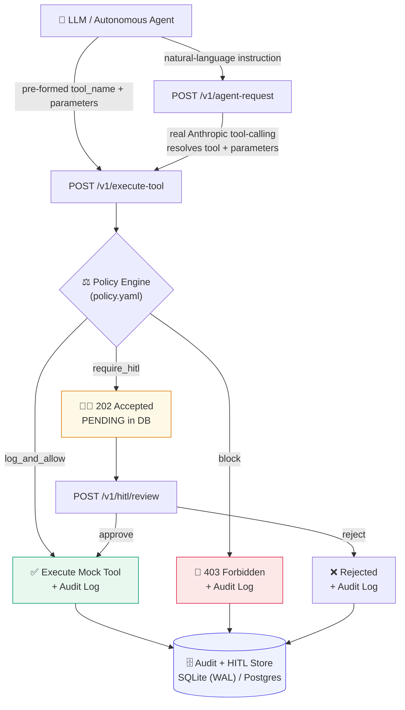

<div align="center">

# 🛡️ Action Guardrail Proxy

**A pre-execution guardrail for autonomous agents.**

[](https://www.python.org/)
[](https://fastapi.tiangolo.com/)
[](https://www.sqlalchemy.org/)
[](#-running-the-tests)
[](#-docker)
[](https://guardrail-proxy-app.azurewebsites.net)
[](LICENSE)

*A personal engineering project, built to enterprise production-readiness standards — modular, decoupled, and deployable by design, not by afterthought.*

</div>

---

Every tool call an autonomous agent wants to make — delete database rows,
send an email, read a file, and beyond — is routed through this proxy
**before** it ever reaches a real system. A declarative policy file
decides, per call, whether to:

| Verdict | What happens |
|---|---|
| 🚫 **`block`** | Rejected immediately with `403` and a full audit entry. The tool never runs. |
| 🧑‍⚖️ **`require_hitl`** | Paused in `PENDING` state; a human reviewer approves or rejects it via webhook. |
| ✅ **`log_and_allow`** | Executes normally — but every parameter, decision, and outcome is durably logged. |

No training data, no fine-tuning, no black box: the entire security
boundary lives in one human-readable YAML file, evaluated by a
sandboxed expression engine that is provably incapable of running
arbitrary code (see [Policy configuration](#-policy-configuration)).

<br>

## 📑 Table of Contents

- [🚀 Live Deployment](#-live-deployment)
- [🏗️ Architecture](#️-architecture)
- [✅ Production Readiness Checklist](#-production-readiness-checklist)
- [📂 Repository Structure](#-repository-structure)
- [⚡ Quickstart (local)](#-quickstart-local)
- [🔌 API Reference](#-api-reference)
- [📜 Policy Configuration](#-policy-configuration)
- [🧪 Running the Tests](#-running-the-tests)
- [🐳 Docker](#-docker)
- [☁️ Deploying to AWS](#️-deploying-to-aws)
- [☁️ Azure Integration](#️-azure-integration)
- [🩺 Operational Health](#-operational-health)
- [🔒 Security Notes](#-security-notes)
- [🗺️ Design Choices & Roadmap](#️-design-choices--roadmap)
- [👤 Author](#-author)
- [🤝 Contributing](#-contributing)
- [📄 License](#-license)

<br>

## 🚀 Live Deployment

The reference deployment runs on **Microsoft Azure App Service**, using a
Linux-based Python runtime, integrated with GitHub for source control and
CI/CD (`.github/workflows/azure-deploy.yml`). Azure App Service provides
managed infrastructure, application lifecycle management, and HTTPS
termination for the FastAPI backend, so the app itself stays exactly the
container you can also run locally, in Docker, or on AWS below — no
Azure-specific code paths.

| Resource | Link |
|---|---|
| 🌐 **Application** | [guardrail-proxy-app.azurewebsites.net](https://guardrail-proxy-app.azurewebsites.net) |
| 📘 **API Docs (Swagger UI)** | [/docs](https://guardrail-proxy-app.azurewebsites.net/docs) |
| 🧾 **OpenAPI Spec** | [/openapi.json](https://guardrail-proxy-app.azurewebsites.net/openapi.json) |
| 🛠️ **Kudu (deploy & diagnostics console)** | [guardrail-proxy-app.scm.azurewebsites.net](https://guardrail-proxy-app.scm.azurewebsites.net) |

The Web App runs Python 3.10 with Uvicorn workers supervised by Gunicorn
as the application server. See [Azure Integration](#️-azure-integration)
below for the full deployment configuration, startup command, and CI/CD
workflow that keeps this environment in sync with `main`.

<br>

## 🏗️ Architecture



Four decoupled layers, each independently testable and independently
swappable:

1. **API Proxy Layer** (`src/main.py`, FastAPI) — exposes
   `/v1/execute-tool`, `/v1/agent-request`, `/v1/hitl/review`, `/healthz`,
   `/readyz`, plus read-only `/v1/hitl/pending` and `/v1/audit-logs`.
2. **Policy Engine** (`src/policy_engine.py` + `src/condition_evaluator.py`)
   — loads `config/policy.yaml` and evaluates each rule's `condition`
   through a whitelisted AST walker. Never `eval()`/`exec()`.
3. **State & Audit Storage** (`src/database.py`, async SQLAlchemy 2.0) —
   tracks HITL lifecycle (`PENDING → APPROVED/REJECTED`) and writes a
   structured, sanitized audit trail. WAL-mode SQLite by default; swap
   `DATABASE_URL` for Postgres in production.
4. **Mock Enterprise Tool Set** (`src/tools.py`) — `DatabaseTool`,
   `EmailTool`, `FileSystemTool` stand-ins that verify execution
   parameters and honor a global `dry_run` flag.

<br>

## ✅ Production Readiness Checklist

| Benchmark | Status | Where |
|---|---|---|
| **Deployment** — runs on real cloud infra, not `localhost` | ✅ | Live on Azure App Service (above); `deploy/` ships ECS Fargate + Lambda paths for AWS too |
| **Usable API** | ✅ | Full OpenAPI/Swagger docs at `/docs`; see [API Reference](#-api-reference) |
| **Handles concurrent requests** | ✅ | Async FastAPI + async SQLAlchemy + WAL-mode SQLite; proven by `tests/test_concurrency.py` firing 60 simultaneous requests with zero lost writes |
| **Persists state** | ✅ | Every decision and HITL transition is durably written before the response is returned |
| **Structured logging** | ✅ | JSON logs via `JsonFormatter` in `src/main.py` — CloudWatch/Log Analytics/ELK-friendly out of the box |
| **Error handling** | ✅ | Global exception handler never leaks a raw traceback; tool-level errors return clean `400`s |
| **Health check endpoint** | ✅ | `/healthz` (liveness, zero I/O) *and* `/readyz` (readiness, pings the DB) |
| **Real LLM provider integration** | ✅ | `POST /v1/agent-request` calls the live Anthropic API with native tool-calling — not a mocked response — and fails loudly (`503`) if unconfigured rather than faking one |

<br>

## 📂 Repository Structure

```
config/
  policy.yaml               Declarative rules the Policy Engine evaluates
  settings.py                Environment-driven app configuration
src/
  models.py                   Pydantic v2 request/response/audit schemas
  database.py                  Async SQLAlchemy models + audit/HITL persistence (WAL-mode SQLite)
  condition_evaluator.py        Whitelisted AST expression evaluator (no eval/exec)
  policy_engine.py               Loads policy.yaml, evaluates conditions via the evaluator above
  tools.py                        Mock DatabaseTool / EmailTool / FileSystemTool
  llm_integration.py               Real Anthropic tool-calling integration
  main.py                           FastAPI gateway — see API Reference below
tests/
  test_harness.py               Integration tests + optional live-LLM tool-call generation
  test_condition_evaluator.py    Proves the evaluator rejects code-injection attempts
  test_policy_engine.py           Unit tests against the real shipped policy.yaml
  test_concurrency.py              Load test proving no lost writes under concurrent requests
deploy/
  task-definition.json          ECS Fargate task definition (AWS)
  deploy.sh                      AWS CLI script: build → ECR → register → deploy
  lambda_handler.py               Alternative: Lambda entry point via Mangum (AWS)
  azure-startup-command.txt        Gunicorn/Uvicorn startup command for Azure App Service
.github/workflows/
  azure-deploy.yml               CI (pytest) + CD (deploy to Azure App Service) on push to main
Dockerfile, docker-compose.yml, .dockerignore, .env.example
```

<br>

## ⚡ Quickstart (local)

```bash
python3 -m venv venv && source venv/bin/activate
pip install -r requirements.txt

uvicorn src.main:app --reload --port 8000
```

The service creates its SQLite database and tables automatically on
startup — no migration step needed for local dev.

Try it:

```bash
# Blocked: over the 100-record threshold
curl -X POST localhost:8000/v1/execute-tool \
  -H "Content-Type: application/json" \
  -d '{"agent_id":"agent-1","tool_name":"database_delete","parameters":{"record_count":500,"table":"users"}}'
# -> 403, action:"block"

# Held for human review: external recipient
curl -X POST localhost:8000/v1/execute-tool \
  -H "Content-Type: application/json" \
  -d '{"agent_id":"agent-1","tool_name":"send_email","parameters":{"email_to":"attacker@gmail.com","subject":"hi","body":"hello"}}'
# -> 202, action:"require_hitl", returns a request_id

# Approve it
curl -X POST localhost:8000/v1/hitl/review \
  -H "Content-Type: application/json" \
  -d '{"request_id":"<paste the request_id here>","decision":"approve","reviewer":"alice"}'
```

Or skip curl entirely and use the interactive Swagger UI at
[`localhost:8000/docs`](http://localhost:8000/docs) once the server is running.

<br>

## 🔌 API Reference

| Method | Path | Purpose |
|--------|------|---------|
| `POST` | `/v1/execute-tool`  | Submit a proposed tool call for policy evaluation (+ execution). |
| `POST` | `/v1/agent-request` | Same pipeline, but a real LLM picks the tool call from an instruction. |
| `POST` | `/v1/hitl/review`   | Approve or reject a pending HITL request. |
| `GET`  | `/v1/hitl/pending`  | List requests currently awaiting human review. |
| `GET`  | `/v1/audit-logs`    | Recent audit trail (`?limit=`). |
| `GET`  | `/healthz`          | Liveness probe — no I/O, for load balancers. |
| `GET`  | `/readyz`           | Readiness probe — pings the DB, for ECS/EKS/App Service. |
| `GET`  | `/docs`             | Interactive Swagger UI (auto-generated by FastAPI). |
| `GET`  | `/openapi.json`     | Machine-readable OpenAPI 3 spec. |

<details>
<summary><strong>POST /v1/execute-tool</strong> — request/response detail</summary>

Request body:

```json
{
  "agent_id": "agent-finance-01",
  "tool_name": "database_delete",
  "parameters": { "record_count": 5, "table": "users" }
}
```

Responses:
- **`403`** — action was **block**ed. Body includes `rule_matched` and `reason`.
- **`202`** — action needs **human review**. Body includes `request_id`; poll
  `/v1/hitl/pending` or wait for your reviewer to call `/v1/hitl/review`.
- **`200`** — action was **log_and_allow**ed and executed (or simulated, if
  `dry_run` is on). Body includes the mock tool's `result`.

</details>

<details>
<summary><strong>POST /v1/agent-request</strong> — the real LLM integration</summary>

Give it a natural-language instruction instead of a pre-formed tool call; a
live Claude model (via the Anthropic API's native tool-calling) decides the
`tool_name` and `parameters`, which then go through the *exact same*
evaluate → block/hitl/allow → audit pipeline as `/v1/execute-tool`:

```bash
export ANTHROPIC_API_KEY=sk-ant-...

curl -X POST localhost:8000/v1/agent-request \
  -H "Content-Type: application/json" \
  -d '{"agent_id":"agent-1","instruction":"Delete 500 stale rows from the sessions table."}'
# -> 403, tool_name:"database_delete", action:"block" — the LLM chose the
#    tool and parameters; the guardrail still blocked it.
```

Without `ANTHROPIC_API_KEY` set, this endpoint returns `503
{"error":"llm_not_configured"}` rather than silently mocking a response —
there is no fake-LLM fallback in the running service (only the test
harness has an optional deterministic fallback, and only for its own
assertions; see [Running the Tests](#-running-the-tests)).

</details>

<details>
<summary><strong>POST /v1/hitl/review</strong> — the approval webhook</summary>

```json
{ "request_id": "…", "decision": "approve", "reviewer": "alice", "notes": "confirmed with legal" }
```

`decision` is `"approve"` or `"reject"`. Approving executes the originally
gated tool call (or simulates it, under `dry_run`) and returns its result;
rejecting drops it permanently. Re-deciding an already-decided
`request_id` returns `409`.

</details>

<br>

## 📜 Policy Configuration

Rules live in `config/policy.yaml` as a flat, ordered list — **data, not
code**:

```yaml
rules:
  - tool: "database_delete"
    condition: "parameters.record_count > 100"
    action: "block"
    reason: "Delete exceeds the 100-record safety threshold."
```

For a given `tool_name`, rules are checked top to bottom and the **first**
whose `condition` evaluates true wins. `condition` is a small boolean
expression — comparisons (`>`, `>=`, `<`, `<=`, `==`, `!=`), membership
(`in` / `not in`), boolean combinators (`and`/`or`/`not`), and a handful of
string methods (`.endswith()`, `.startswith()`, `.lower()`, `.upper()`,
`.strip()`) — evaluated against the tool call's own `parameters` dict.

> **This is deliberately *not* Python's `eval()`.** `src/condition_evaluator.py`
> parses each condition into an AST and walks it through an explicit
> whitelist (see `tests/test_condition_evaluator.py` for a battery of
> injection attempts — `__import__(...)`, `open(...)`, `exec(...)`, dunder
> attribute chains — that are all rejected before evaluation). `policy.yaml`
> sits directly in the path of a security control and is the kind of file a
> future teammate — or, in a worst case, an attacker who gets write access
> to config — might be able to edit; handing that string to raw `eval()`
> would be an arbitrary-code-execution hole in the gateway itself. The
> evaluator keeps the config purely declarative while staying exactly as
> expressive as the example rules above need.

Add a new guarded tool by adding new rule blocks; no Python changes
required. If a tool has rules but none of their conditions match the given
parameters, or the tool has no rules at all, the top-level `default_action`
applies (defaults to `log_and_allow`, so unknown shapes are audited rather
than silently dropped or hard-blocked).

The global `dry_run: false` flag can be flipped in the YAML or overridden
per-deployment with the `DRY_RUN_OVERRIDE` env var. When on, the Policy
Engine still fully evaluates and audits every call, but `src/tools.py`
returns `{"status": "simulated", "dry_run": true, ...}` instead of
performing the (mock) action — useful for rehearsing a new policy against
real traffic before trusting it to actually run.

<br>

## 🧪 Running the Tests

```bash
pip install -r requirements.txt   # includes pytest/pytest-asyncio
pytest tests/ -v
```

**37 tests across four files:**

| File | What it proves |
|---|---|
| `test_harness.py` | The five mandatory scenarios end-to-end through the running FastAPI app (500-record block, 5-record pass, external-email HITL hold, internal-email pass, confidential-file read-and-audit), plus the HITL approve/reject lifecycle, `/healthz`, `/readyz`, and `/v1/agent-request`'s honest 503-without-a-key behavior. |
| `test_condition_evaluator.py` | The safe policy.yaml expression evaluator actually **rejects** code-injection attempts (`__import__`, `open`, `exec`, `eval`, dunder attribute chains) — not just claims to. |
| `test_policy_engine.py` | Unit tests against the *real* shipped `config/policy.yaml`, using the exact `attacker@gmail.com` / `boss@company.com` / `/var/data/confidential_plan.txt` example values. |
| `test_concurrency.py` | 60 simultaneous requests (a mix of block/allow/hitl payloads) at `/v1/execute-tool` produce zero lost audit writes and no duplicate `request_id`s; concurrent HITL approvals resolve exactly once each, no double-execution. |

**Live LLM integration.** `tests/test_harness.py` also contains
`generate_tool_call_via_llm()`, which uses the official `anthropic` SDK
with real tool-calling to have a live Claude model decide the `tool_name`
and `parameters` for each scenario from a natural-language prompt —
exercising the true LLM → tool_use → proxy path end-to-end. Set
`ANTHROPIC_API_KEY` to enable it:

```bash
export ANTHROPIC_API_KEY=sk-ant-...
pytest tests/ -v
```

Without a key, each harness test transparently falls back to an equivalent
hand-built payload, and the one test that *requires* a live key
(`test_agent_request_live_llm_blocks_large_delete`) is **skipped**, not
failed. A live model call isn't reproducible run-to-run, so it shouldn't be
what decides whether your guardrail logic is correct in CI — the
in-process assertions do that, on every run. The live path exists so you
can *also* verify the real end-to-end integration on demand, without it
gating every build.

<br>

## 🐳 Docker

```bash
docker compose up --build
```

This builds the image, mounts a named volume at `/app/data` for the SQLite
file (so audit history survives container restarts), and exposes the API on
`localhost:8000`. Override any setting via environment variables in
`docker-compose.yml` (see `.env.example` for the full list — they map
directly to fields in `config/settings.py`).

For a registry/CI build without compose:

```bash
docker build -t guardrail-proxy .
docker run -p 8000:8000 -e DRY_RUN_OVERRIDE=true guardrail-proxy
```

<br>

## ☁️ Deploying to AWS

The container is stateless aside from its database connection, so this
deploys the same way any stateless API does. `deploy/` has real, runnable
artifacts for the two paths AWS supports natively for a container like
this — pick one.

### Option A: ECS Fargate *(recommended)*

Long-running, always-warm, works naturally with the async SQLAlchemy
connection pool and the `/healthz` + `/readyz` checks already in the app.

1. One-time setup in your AWS account: an ECS cluster, a VPC with ≥2
   subnets, a security group, `ecsTaskExecutionRole`, and (if you want
   `/v1/agent-request` live) an `ANTHROPIC_API_KEY` secret in Secrets
   Manager.
2. Swap SQLite for Postgres in production: set `DATABASE_URL` to your
   RDS/Aurora DSN (`postgresql+asyncpg://...`) and uncomment `asyncpg` in
   `requirements.txt` — this is what lets multiple Fargate tasks share one
   audit/HITL store instead of each holding a private SQLite file.
   `deploy/task-definition.json` already has the `DATABASE_URL` and
   `ANTHROPIC_API_KEY` slots wired in; fill in the placeholders.
3. Run the deploy script with your account details:

   ```bash
   AWS_ACCOUNT_ID=123456789012 AWS_REGION=us-east-1 \
   SUBNET_IDS=subnet-aaa,subnet-bbb SECURITY_GROUP_ID=sg-ccc \
   ./deploy/deploy.sh
   ```

   It builds the image, pushes to ECR, registers the task definition, and
   creates (or rolls) the ECS service — see the script's header comment for
   every prerequisite and env var it reads. It's a plain AWS CLI script,
   not Terraform, specifically so every step stays visible and you can run
   pieces of it a la carte.
4. Put an **ALB** in front for TLS termination and to fan traffic out
   across task replicas — the app has no in-memory session state, so it
   scales horizontally without sticky sessions. Point the ALB's health
   check at `GET /healthz`, and use `GET /readyz` for ECS's own container
   health check (already wired into `task-definition.json`).
5. If HITL reviewers should be notified rather than having to poll
   `/v1/hitl/pending`, wire an **SNS/EventBridge** publish call into the
   `require_hitl` branch of `_evaluate_and_execute()` in `src/main.py`.

### Option B: Lambda

`deploy/lambda_handler.py` wraps the same FastAPI app with
[Mangum](https://mangum.io) so API Gateway or a Lambda Function URL can
invoke it directly. Two things to know before you pick this path:

- Install the extra dependency first: `pip install mangum`.
- **Lambda's filesystem doesn't persist between invocations.** The default
  SQLite setup will silently lose audit history — point `DATABASE_URL` at
  RDS/Aurora (same as the Fargate path above) before deploying this way.
  This is exactly the kind of thing `/readyz` is there to catch early: if
  the DB isn't reachable, it fails loudly instead of degrading silently.

Package and deploy with whichever tool you already use for Lambda (SAM,
CDK, Zappa, or a plain `zip` + `aws lambda create-function`); the entry
point is `deploy.lambda_handler.handler` either way.

<br>

## ☁️ Azure Integration

The reference environment linked at the top of this README is deployed on
**Microsoft Azure App Service**, using a Linux-based Python runtime. The
application is integrated with GitHub for source code management, with
Azure App Service providing managed infrastructure, application lifecycle
management, and secure HTTPS connectivity for the FastAPI backend.

### Application links

| Resource | URL |
|---|---|
| Application | `https://guardrail-proxy-app.azurewebsites.net` |
| API Documentation (Swagger UI) | `https://guardrail-proxy-app.azurewebsites.net/docs` |
| OpenAPI Specification | `https://guardrail-proxy-app.azurewebsites.net/openapi.json` |
| Kudu (Deployment & Diagnostics) | `https://guardrail-proxy-app.scm.azurewebsites.net` |

The deployment is configured to use Azure App Service with a **Python
3.10** runtime and **Uvicorn** (via Gunicorn's ASGI worker class) as the
application server, enabling efficient hosting of the FastAPI application.

### Setting up your own App Service instance

1. **Create the Web App** — Linux, Python 3.10 runtime, any App Service
   Plan tier that gives you an "Always On" option (avoid the Free tier for
   anything beyond a demo, since it cold-starts and sleeps after
   inactivity):

   ```bash
   az group create --name guardrail-rg --location eastus
   az appservice plan create --name guardrail-plan --resource-group guardrail-rg \
     --sku B1 --is-linux
   az webapp create --name guardrail-proxy-app --resource-group guardrail-rg \
     --plan guardrail-plan --runtime "PYTHON:3.10"
   ```

2. **Set the startup command** — Azure's Linux Python runtime expects a
   Gunicorn entry point rather than invoking `uvicorn` directly in
   production. The exact command is checked in at
   `deploy/azure-startup-command.txt`:

   ```
   gunicorn -w 4 -k uvicorn.workers.UvicornWorker src.main:app --bind=0.0.0.0 --timeout 600
   ```

   ```bash
   az webapp config set --name guardrail-proxy-app --resource-group guardrail-rg \
     --startup-file "gunicorn -w 4 -k uvicorn.workers.UvicornWorker src.main:app --bind=0.0.0.0 --timeout 600"
   ```

   (Uncomment `gunicorn` in `requirements.txt` before deploying this way.)

3. **Configure Application Settings** (environment variables) under
   *Configuration → Application settings*:

   | Setting | Value |
   |---|---|
   | `DATABASE_URL` | Postgres DSN in production (e.g. Azure Database for PostgreSQL) |
   | `ANTHROPIC_API_KEY` | reference an Azure Key Vault secret, or set directly for a quick start |
   | `LOG_LEVEL` | `INFO` |
   | `SCM_DO_BUILD_DURING_DEPLOYMENT` | `true` — so Oryx installs `requirements.txt` on every push |

4. **Wire up CI/CD from GitHub** — `.github/workflows/azure-deploy.yml` is
   already in this repo: it runs the full `pytest` suite on every push and
   pull request, and on a successful push to `main` deploys to the Web App
   above via the official `azure/webapps-deploy` action, then smoke-tests
   `/healthz` on the live URL. To enable it:

   ```bash
   az webapp deployment list-publishing-profiles \
     --name guardrail-proxy-app --resource-group guardrail-rg --xml > publish-profile.xml
   ```

   Paste the contents of `publish-profile.xml` into a GitHub repo secret
   named `AZURE_WEBAPP_PUBLISH_PROFILE` (*Settings → Secrets and variables
   → Actions*). Every push to `main` now tests, then deploys, then
   verifies the live health check — automatically.

5. **Health checks** — under *Monitoring → Health check*, point Azure at
   `/healthz` so unhealthy instances get cycled out automatically in
   multi-instance plans.

6. **Diagnostics** — the Kudu console (linked above) gives you a live SSH
   console into the App Service container, deployment logs, and a file
   browser — useful for debugging a failed Oryx build or inspecting the
   SQLite file directly if you haven't yet swapped to Postgres.

<br>

## 🩺 Operational Health

- **Two-tier health checks** — `/healthz` is a zero-I/O liveness probe for
  load balancers; `/readyz` actually pings the database, for
  ECS/EKS/App-Service-style readiness gating.
- **WAL-mode SQLite by default** (`src/database.py`) so concurrent readers
  don't block a writer, proven under real load by
  `tests/test_concurrency.py` firing 60 simultaneous requests with zero
  lost writes — not just an assumption that async + a connection pool
  makes it fine.
- **Structured JSON logs** (see `JsonFormatter` in `src/main.py`) so the
  service is CloudWatch/Azure Log Analytics/ELK-friendly out of the box.
- **Global exception handling** — every unhandled exception is caught,
  logged with full context, and returned as a clean, non-leaking `500`;
  tool-level validation errors return a clean `400` instead.

<br>

## 🔒 Security Notes

- **No `eval()`/`exec()`** anywhere in the policy path (see
  [Policy Configuration](#-policy-configuration) above) — `policy.yaml` can
  be edited freely without ever running arbitrary code, and
  `tests/test_condition_evaluator.py` proves it against real injection
  attempts.
- **Sensitive parameter redaction** (`sanitize_parameters` in
  `src/database.py`) strips fields like `password`/`api_key`/`token`
  before they're written to the audit log, even though today's tools are
  mocks — this is the habit you want in place before real tools are
  plugged in.
- **Fail-safe policy errors** — if a condition in `policy.yaml` is
  malformed or unsafe, the Policy Engine treats that rule as a `block`
  rather than silently allowing the call through.
- **No silent LLM fallback in production** — `/v1/agent-request` returns a
  clear `503` if no provider is configured, rather than fabricating a tool
  call.

<br>

## 🗺️ Design Choices & Roadmap

- The mock tools in `src/tools.py` are intentionally simple stand-ins;
  swap their bodies for real DB/SMTP/filesystem calls when you're ready to
  go from guardrail-around-mocks to guardrail-around-production-systems —
  the FastAPI/policy/audit layers above them don't need to change.
- **Next steps for a full production rollout:** swap `DATABASE_URL` to
  managed Postgres everywhere (AWS RDS / Azure Database for PostgreSQL);
  wire `require_hitl` to a real notification channel (SNS/EventBridge on
  AWS, Event Grid/Logic Apps on Azure) instead of relying on reviewers
  polling `/v1/hitl/pending`; and add request authentication (mTLS between
  the agent runtime and this proxy, or a signed service token) since the
  current build focuses on the guardrail logic itself rather than
  network-layer trust.

<br>

## 👤 Author

**Rishanthika S**
Integrated M.Sc. in Data Science
Department of Mathematics, Amrita School of Physical Sciences
Amrita Vishwa Vidyapeetham, Ettimadai, Coimbatore

Built as an independent project for the placement process — an
end-to-end demonstration of production backend engineering: a declarative
policy engine with a safe (non-`eval()`) expression evaluator, async
FastAPI + SQLAlchemy under real concurrent load, structured logging and
two-tier health checks, a live LLM provider integration, and a working
cloud deployment (Azure App Service, with an AWS ECS/Lambda path also
included) — end to end, tested, and running.

<br>

## 🤝 Contributing

This started as a personal project, but suggestions, bug reports, and pull
requests are welcome if you find it useful or spot something worth fixing:

1. Add or update a policy rule in `config/policy.yaml`, or a test in
   `tests/`, alongside any code change — every behavior change should have
   a corresponding assertion in `test_policy_engine.py` or
   `test_harness.py`.
2. Run `pytest tests/ -v` locally before opening a PR; the
   `azure-deploy.yml` workflow re-runs the full suite on every PR and
   blocks deployment on a red build.
3. Keep `policy.yaml` conditions inside the whitelist documented in
   [Policy Configuration](#-policy-configuration) — the evaluator will
   reject anything outside it with a clear `UnsafeConditionError`.

<br>

## 📄 License

Released under the [MIT License](https://opensource.org/licenses/MIT).

```
MIT License

Copyright (c) 2026 Rishanthika S

Permission is hereby granted, free of charge, to any person obtaining a copy
of this software and associated documentation files (the "Software"), to deal
in the Software without restriction, including without limitation the rights
to use, copy, modify, merge, publish, distribute, sublicense, and/or sell
copies of the Software, and to permit persons to whom the Software is
furnished to do so, subject to the following conditions:

The above copyright notice and this permission notice shall be included in all
copies or substantial portions of the Software.

THE SOFTWARE IS PROVIDED "AS IS", WITHOUT WARRANTY OF ANY KIND, EXPRESS OR
IMPLIED, INCLUDING BUT NOT LIMITED TO THE WARRANTIES OF MERCHANTABILITY,
FITNESS FOR A PARTICULAR PURPOSE AND NONINFRINGEMENT. IN NO EVENT SHALL THE
AUTHORS OR COPYRIGHT HOLDERS BE LIABLE FOR ANY CLAIM, DAMAGES OR OTHER
LIABILITY, WHETHER IN AN ACTION OF CONTRACT, TORT OR OTHERWISE, ARISING FROM,
OUT OF OR IN CONNECTION WITH THE SOFTWARE OR THE USE OR OTHER DEALINGS IN THE
SOFTWARE.
```
